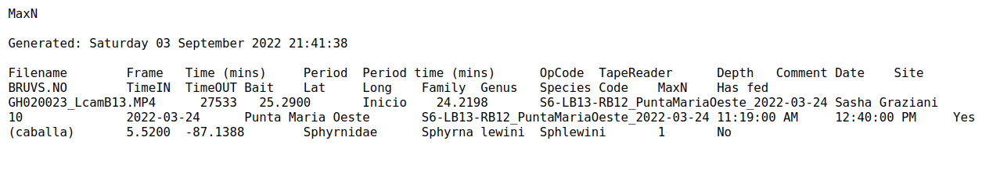

```{=html}
<style>
body
  { counter-reset: source-line 0; }
pre.numberSource code
  { counter-reset: none; }
</style>
```

```{r,echo=FALSE,message=FALSE}

options("digits" = 5)
options("digits.secs" = 3)

# options to customize chunk outputs
knitr::opts_chunk$set(
  class.source = "numberLines lineAnchors", # for code line numbers
  message = FALSE
)
```

::: {.alert .alert-info}
# Objetivos del manual {.unnumbered .unlisted}

- Aprender a aplicar de forma serial operaciones que deben repetirse sobre diferentes objetos
- Familiarizarse con el uso de bucles en la plataforma R
- Tener una noción general de los opciones disponibles en R para construir bucles
:::

------------------------------------------------------------------------

Primero debemos preparar los archivos de ejemplo:

```{r, eval = FALSE}

# definir directorio a donde guardar los archivos
directorio <- "DIRECCION_DONDE_GUARDAR_LOS ARCHIVOS_DE_EJEMPLO"

# guardar archivos
download.file(
  url = paste0(
    "https://github.com/maRce10/ucr_r_avanzado/",
    "raw/master/additional_files/datos_camara_submarina.zip"
  ),
  destfile = file.path(directorio, "datos_camara_submarina.zip")
)

# extraerlos del zip
unzip(
  zipfile = file.path(directorio, "datos_camara_submarina.zip"),
  exdir = directorio
)

# hacer vector con nombre y direccion de archivos
archivos_txt <-
  list.files(
    path = directorio,
    full.names = TRUE,
    pattern = "TXT$"
  )
```

```{r, echo = FALSE}

# definir directorio a donde guardar los archivos
directorio <- "./data/"

# guardar archivos
download.file(
  url =
    paste0(
      "https://github.com/maRce10/",
      "r_avanzado_2023/raw/master/data/datos_camara_submarina.zip"
    ),
  destfile = file.path(directorio, "datos_camara_submarina.zip")
)

# extraerlos del zip
unzip(zipfile = file.path(directorio, "datos_camara_submarina.zip"), exdir = directorio)

# hacer vector con nombre y direccion de archivos
archivos_txt <- list.files(path = directorio, full.names = TRUE, pattern = "TXT$")

```

También pueden bajar el archivo directamente de [este enlance](https://github.com/maRce10/ucr_r_avanzado/raw/master/additional_files/datos_camara_submarina.zip). Recuerde extraer los archivos y hacer el vector con los nombres de los archivos (correr lineas de la 9 a la 13).

Si todo salió bien el vector "archivos_txt" deberia tener `r length(archivos_txt)` elementos:

```{r}

length(archivos_txt)
```

------------------------------------------------------------------------

::: {.alert .alert-warning}
# Bucles (loops)

- Proceso automatizado de varios pasos organizado como secuencias de acciones (p. Ej., procesos 'por lotes')
- Se usa para acelerar los procedimientos en los que se aplica la misma acción a muchos objetos (similares)
- Crítico para la gestión de grandes bases de datos ('big data', y buenas prácticas de programación)

```{mermaid}

flowchart LR
    classDef largeText font-size:18px, padding:15px;

    A(Inicio del bucle) --> B("¿Hay más elementos?")
    B -- Sí --> C(Realizar tarea)
    C --> D(Guardar resultado)
    D --> B
    B -- No --> E(Fin del bucle)

    style A fill:#28192F66, stroke:#000, stroke-width:2px, color:#FFF
    style B fill:#40498E66, stroke:#000, stroke-width:2px, color:#FFF
    style C fill:#348AA666, stroke:#000, stroke-width:2px, color:#FFF
    style D fill:#357BA266, stroke:#000, stroke-width:2px, color:#FFF

```

En este manual nos enfocaremos en bucles que se ejecutan para un número predefinido de iteraciones. Estos se subdividen en dos clases:

a.  Los resultados pueden ingresarse nuevamente en la siguiente iteración (bucles `for`)

```{mermaid}

flowchart LR
    classDef largeText font-size:18px, padding:15px;

    A("Inicio del bucle") --> B("¿Hay más elementos?")
    B -- Sí --> C(Realizar tarea)
    C --> D(Guardar resultado)
    D --> C
    D --> B
    B -- No --> E(Fin del bucle)

    style A fill:#28192F66, stroke:#000, stroke-width:2px, color:#FFF
    style B fill:#40498E66, stroke:#000, stroke-width:2px, color:#FFF
    style C fill:#348AA666, stroke:#000, stroke-width:2px, color:#FFF
    style D fill:#357BA266, stroke:#000, stroke-width:2px, color:#FFF

```

b.  Los resultados de una interacción no pueden afectar a otras iteraciones (bucles `(X)apply`)

```{mermaid}


flowchart LR
    classDef largeText font-size:18px, padding:15px;

    A("Inicio del bucle") --> B("¿Hay más elementos?")
    B -- Sí --> C(Realizar tarea)
    C --> D(Guardar resultado)
    D --> B
    B -- No --> E(Fin del bucle)

    style A fill:#28192F66, stroke:#000, stroke-width:2px, color:#FFF
    style B fill:#40498E66, stroke:#000, stroke-width:2px, color:#FFF
    style C fill:#348AA666, stroke:#000, stroke-width:2px, color:#FFF
    style D fill:#357BA266, stroke:#000, stroke-width:2px, color:#FFF

```
:::

------------------------------------------------------------------------

# Bucles 'for'

Por mucho, `for` es el bucle más popular. Se caracteriza por que el número de iteraciones se puede determinar de antemano y las iteraciones pueden tomar en cuenta resultados de iteraciones anteriores:

```{mermaid}

flowchart LR
    classDef largeText font-size:18px, padding:15px;

    A("for (i in vector)") --> B("¿Hay más elementos?")
    B -- Sí --> C(Realizar tarea)
    C --> D(Guardar resultado)
    D --> C(Usar resultado previo)
    D --> B
    B -- No --> E(Fin del bucle for)

    style A fill:#28192F66, stroke:#000, stroke-width:2px, color:#FFF
    style B fill:#40498E66, stroke:#000, stroke-width:2px, color:#FFF
    style C fill:#348AA666, stroke:#000, stroke-width:2px, color:#FFF
    style D fill:#357BA266, stroke:#000, stroke-width:2px, color:#FFF

```

El bucle `for` se inicia con el operador `for`. A este se le da un vector (*sensu lato*: lista o vector atómico) sobre el cual repetir una tarea. La tarea se encuentra en el cuerpo del bucle:

```{r}
vctr <- 1:3 # vector sobre el cual iterar el bucle

for (i in vctr) { # inicio del bucle
  print(i^2)
} # cuerpo del bucle
```

Note que en dentro de los paréntesis del operador `for` se usa el operador `in`. Este denota el nombre de objeto que se usará en el cuerpo del bucle para asignar los velores del vector. El bucle devuelve 3 valores, uno para cada valor en `vctr`.

Una forma mas clara de demostrar como el bucle repite la acción de forma serial sobre cada elemento del vector es añadiendo pausas entre iteraciones. La función `Sys.sleep()` pausa el código de R por el número de segundos que se le defina:

```{r}

vctr <- 1:3 # vector sobre el cual iterar el bucle

for (i in vctr) { # inicio del bucle
  print(paste("# corriendo iteración", i))
  Sys.sleep(2) # pausar 2 segundos
  print(i^2) # cuerpo del bucle
}
```

En este caso vemos como el bucle toma una pausa entre cada iteración y luego hace el cálculo (cuando corre el código en su computadora).

Si deseamos guardar el resultado de las operaciones debemos añadirlo a un vector vacío. Para hacer esto hay 2 opciones:

- Usando la función `append()`
- Agregar nuevos elementos a un vector usando indexación

El siguiente código guarda los resultados usando `append()`:

```{r}

# vector sobre el cual iterar el bucle
vctr <- 1:3

# vector vacio
resultados <- vector()

# inicio del bucle
for (i in vctr) {
  # cuerpo del bucle
  i2 <- i^2

  # guardar resultados en vector vacio
  resultados <- append(resultados, i2)
}

# ver resultados
resultados
```

Note que `append()` se usa dentro del cuerpo del bucle luego de hacer los cálculos.

Así podemos guardar los resultados usando indexación:

```{r}

# vector sobre el cual iterar el bucle
vctr <- 1:3

# vector vacio
resultados <- vector()

# inicio del bucle
for (i in vctr) {
  # cuerpo del bucle
  i2 <- i^2

  # guardar resultados en vector vacio
  resultados[length(resultados) + 1] <- i2
}

resultados
```

Estos bucles se pueden correr sobre cualquier vector. Por ejemplo podemos evaluar para el juego de datos `iris` el promedio del largo del sépalo para cada especie de esta forma:

```{r}

# vector sobre el cual iterar el bucle
vctr <- unique(iris$Species)

# vector vacio
resultados <- vector()

# inicio del bucle
for (i in vctr) {
  # cuerpo del bucle
  i2 <- mean(iris$Sepal.Length[iris$Species == i])

  # guardar resultados en vector vacio
  resultados <- append(resultados, i2)
}

# añadir nombre de especies
names(resultados) <- vctr

resultados
```

## Aplicación al manejo de datos

Usaremos los datos de ejemplo que bajamos al inicio del manual para demostrar la utilidad del los bucles en el manejo de datos. Estos datos muestran la salida de un programa de identificación automática de especies marinas en videos pasivos tomados en la columna de agua. Para cada video analizado el programa genera un archivo de texto (.TXT) con una fila para cada especie detectada mas una serie de metadatos asociados a la detección. Los datos se ven así:

```{r, echo=FALSE,out.width="100%", fig.align="center"}


```

Recordemos que los nombres de los archivos .TXT están guardados en un vector llamado `archivos_txt`. Podemos leer el primer archivo (i.e. el primer elemento en `archivos_txt`) de la siguiente forma:

```{r}
# leer primer archivo
archivo1 <-
  read.table(archivos_txt[1],
             header = TRUE,
             skip = 4,
             sep = "\t")

# ver pirmeras 6 filas y 8 columnas
head(archivo1[, 1:8])
```

Podemos saber cuantas especies se observaron en ese muestreo simplemente calculado el número de filas en `archivo`:

```{r}

nrow(archivo1)
```

Ahora, para hacer esto con todos los archivos **no es eficiente leer cada uno en su propia linea de código** y luego calcular el número de filas. Al fin de cuentas, todos los códigos serian muy parecidos, solo cambiaría el nombre del archivo. Es en estos casos que los bucles son de gran utilidad. En este ejemplo solo debemos incorporar el código de lectura del archivo y del cálculo del número de filas en el cuerpo del bucle, usando el nombre de los archivos (`archivos_txt`) como el vector sobre el cual iterar el bucle:

```{r}


# vector vacio
resultados <- vector()

# inicio del bucle
for (i in archivos_txt) {
  # leer archivo
  txt <- read.table(i,
                    header = TRUE,
                    skip = 4,
                    sep = "\t")
  # calcular numero de filas
  n_sp <- nrow(txt)

  # guardar resultados en vector vacio
  resultados <- append(resultados, n_sp)
}

resultados
```

Podemos ordenar estos resultados fácilmente haciendo un cuadro de datos (data.frame). Para esto creamos una columna con el nombre del archivo y otra con el resultado del número de filas:

```{r}

# organizar en data frame
n_sp_df <-
  data.frame(archivo = basename(archivos_txt),
             n_sp = resultados)

# ver primeras 6 filas
head(n_sp_df)
```

::: {.alert .alert-info}

## Ejercicio 1

Un patrón clásico en ecología marina es que la diversidad no se distribuye de forma uniforme con la profundidad: la disponibilidad de luz, la presión, la temperatura y el oxígeno disuelto cambian a medida que se desciende en la columna de agua, lo que puede favorecer a distintos grupos taxonómicos en distintos rangos de profundidad. 

Entender cómo varían la riqueza de especies y de familias con la profundidad es entonces una pregunta ecológica relevante. Este es justo el tipo de análisis para el que los bucles resultan útiles: en vez de leer y resumir cada uno de los `r length(archivos_txt)` archivos de video a mano, podemos usar un bucle `for` para extraer automáticamente el número de especies y de familias observadas en cada muestreo, y así construir un cuadro de datos que luego relacionemos con la profundidad de cada video.

Podemos calcular el número de familias observadas para el primer archivo que leímos (`archivo1`) de esta forma:

```{r}

length(unique(archivo1$Family))
```

1.1 Haga un bucle `for` que devuelva el número de familias para cada archivo

```{r, eval = FALSE, echo = FALSE}

# vector vacio
resultados <- vector()

# inicio del bucle
for (i in archivos_txt) {
  # leer archivo
  txt <- read.table(i,
                    header = TRUE,
                    skip = 4,
                    sep = "\t")

  # calcular numero de familias
  nfam <- length(unique(txt$Family))

  # guardar resultados en vector vacio
  resultados <- append(resultados, nfam)
}

n_sp_df$familias <- resultados
```

El siguiente código crea un cuadro de datos (data frame) que contenga dos columnas, una para el nombre del archivo y otra para el número de familias

```{r}

n_familias_df <-
  data.frame(archivo = basename(archivos_txt),
             n_familias = resultados)
```

1.2 Añada una columna al cuadro de datos creado en el ejercicio anterior indicando la fecha de creación del video (esta información se encuentra en la columna 'Date' de cada archivo de texto). Note que cada archivo contiene solamente una fecha. Debe usar un bucle `for` para extraer esta información de los archivos.

```{r, eval = FALSE, echo = FALSE}

# vector vacio
resultados <- vector()

# inicio del bucle
for (i in archivos_txt) {
  # leer archivo
  txt <- read.table(i,
                    header = TRUE,
                    skip = 4,
                    sep = "\t")

  # guardar fecha
  fecha <- txt$Date[1]

  # guardar resultados en vector vacio
  resultados <- append(resultados, fecha)
}

n_sp_df$fecha <- resultados
```

1.3 Añada una columna al cuadro de datos creado en el ejercicio 1.2 (y modificado en 1.3) indicando la profundidad a la que se grabó el video. Debe usar un bucle `for` para extraer esta información de los archivos.

```{r, eval = FALSE, echo = FALSE}

resultados <- vector() # vector vacio

for (i in archivos_txt) {
  # inicio del bucle

  txt <-
    read.table(i,
               header = TRUE,
               skip = 4,
               sep = "\t") # leer archivo
  prof <- txt$Depth[1] # calcular numero de familias

  resultados <-
    append(resultados, prof) # guardar resultados en vector vacio
}

resultados <- gsub(" m", "", resultados)
resultados <- gsub("\\,", ".", resultados)
n_sp_df$profundidad <- as.numeric(resultados)
```

Puede usar el siguiente código para convertir profundidad a un vector numérico:

```{r, eval=FALSE}

n_sp_df$profundidad <-
  as.numeric(gsub(" m", "", gsub("\\,",
                                 ".",
                                 n_sp_df$profundidad)))
```

1.4 ¿Cuál es la correlación entre el número de especies observadas (que es igual al número de filas) y la profundidad? Utilice el data frame generado para responder esta pregunta. (pista: `cor.test()`)

1.5 ¿Cuál es la correlación entre el número de familias y la profundidad? 

```{r, eval = FALSE, echo = FALSE}
cor(n_sp_df$profundidad, n_sp_df$familias)
```

:::

El bucle `for` también puede ser usado para juntar todas los datos de los archivos de texto en un solo cuadro de datos. Esto lo podemos hacer "rellenando" un cuadro de datos vacío, de forma análoga a como rellenamos un vector vació anteriormente:

```{r, eval = TRUE, echo = TRUE}

# vector vacio
df_resultados <- data.frame()

# inicio del bucle
for (i in archivos_txt) {
  # leer archivo
  txt <- read.table(i,
                    header = TRUE,
                    skip = 4,
                    sep = "\t")

  # guardar resultados en vector vacio
  df_resultados <- rbind(df_resultados, txt)
}

nrow(df_resultados) == sum(n_sp_df$filas)
```

------------------------------------------------------------------------

# Bucles '(X)apply'

`(X)apply` se refiere en realidad a una familia de funciones que toman una función como entrada y la aplican a una secuencia de objetos (vectores *sensu lato*). Por lo tanto hay varias funciones `(X)apply` en R:

```{r}
apropos("apply$")
```

Sin embargo, las más utilizadas son `apply`,`sapply`, `lapply` y`tapply`. Todos siguen la misma lógica:

```{mermaid}

flowchart LR
    classDef largeText font-size:18px, padding:15px;

    A("Inicio bucle 'X'apply") --> B("¿Hay más elementos?")
    B -- Sí --> C(Realizar tarea)
    C --> D(Guardar resultado)
    D --> B
    B -- No --> E(Fin del bucle)

    style A fill:#28192F66, stroke:#000, stroke-width:2px, color:#FFF
    style B fill:#40498E66, stroke:#000, stroke-width:2px, color:#FFF
    style C fill:#348AA666, stroke:#000, stroke-width:2px, color:#FFF
    style D fill:#357BA266, stroke:#000, stroke-width:2px, color:#FFF

```

`lapply` toma un vector (atómico o de lista), aplica una función a cada elemento y devuelve una lista:

```{r, eval = TRUE}

lapply(X = c(4, 9, 16), FUN = sqrt)
```

`sapply` también toma un vector (atómico o de lista) y aplica la función a cada elemento, sin embargo, el resultado es un vector atómico (si es que se puede empaquetar como un vector):

```{r, eval = TRUE}

lapply(X = c(4, 9, 16), FUN = sqrt)
```

`apply` aplica una función a cada una de las filas o columnas de un objeto bidimensional. Por ejemplo, el siguiente código calcula el promedio para largo y ancho de sépalo en el juego de datos `iris`:

```{r}

# promedio de largo y ancho de setalo
apply(X = iris[, c("Sepal.Length", "Sepal.Width")],
      MARGIN = 2,
      FUN = mean)
```

Note que el argumento 'MARGIN' indica si el calculo se lleva a cabo a nivel de filas (`MARGIN = 1`) o columnas (`MARGIN = 2`).

`tapply` es más específico ya que aplica una función a un subconjunto de datos definido por un vector categórico adicional. Por ejemplo, podemos calcular la longitud promedio de pétalo para cada especie en el juego de datos 'iris' de la siguiente manera:

```{r, eval=T, echo=T}

tapply(X = iris$Petal.Length,
       INDEX = iris$Species,
       FUN = mean)
```

Los bucles `(X)apply` pueden modificarse para realizar acciones personalizadas creando nuevas funciones (ya sea dentro o fuera del bucle):

```{r, eval = TRUE}

# funcion desde fuera del bucle
n_filas <- function(x) {
  # leer archivo
  txt <- read.table(x,
                    header = TRUE,
                    skip = 4,
                    sep = "\t")

  # calcular numero de filas
  nrw <- nrow(txt)
  return(nrw)
}

# correr bucle
filas <- lapply(X = archivos_txt, FUN = n_filas)

# ver resultados
head(filas)
```

Note que el resultado es una lista. Si deseamos generar un vector podemos usar el bucle `sapply`:

```{r, eval = TRUE}

# correr bucle
filas <- sapply(X = archivos_txt, FUN = n_filas)

# ver resultados
head(filas)
```

Podemos usar funciones anónimas (i.e. funciones que se crean dentro del llamado del bucle) así:

```{r, eval = TRUE}

# correr bucle
filas <- sapply(
  X = archivos_txt,
  FUN = function(x) {
    nrow(read.table(
      x,
      header = TRUE,
      skip = 4,
      sep = "\t"
    ))
  }
)

# ver resultados
head(filas)
```

Tenga en cuenta que:

1)  en este tipo de bucles no hay retroalimentación de las iteraciones anteriores (es decir, los resultados de una iteración no se pueden ingresar en las iteraciones posteriores)

2)  `(X)apply` es más limpio que otros bucles porque los objetos creados dentro de ellos no están disponibles en el entorno de trabajo actual.

## bucles `replicate`

El bucle `replicate` también pertenece a la familia de los `(X)apply` (a pesar de su nombre), ya que toma una función y la replica. Sin embargo solo replica una acción (generalmente aleatoria) y el usuario no tiene control sobre el insumo a la función. El argumento 'n' define cuantas veces se replica la acción y 'expr' define la acción a realizar:

```{r}

replicate(n = 3, expr = rnorm(10))
```

Note que los resultados son agrupados en una matrix. 'expr' también puede replicar código que no ha sido "empaquetado en una función".

::: {.alert .alert-info}
## Ejercicio 2

2.1 Haga un bucle `lapply` equivalente al bucle `for` en el ejercicio 1.1.

2.2 Haga un bucle `sapply` equivalente al bucle `for` en el ejercicio 1.1 y ponga el resultado en un cuadro de datos, similiar a lo hecho en el ejercicio 1.

2.3 Haga un bucle `sapply` que permita añadir al cuadro de datos creado en el ejercicio anterior (2.2) el total de individuos observados en un muestreo (pista: sumatoria de la columna 'MaxN').

2.4 Haga un bucle `tapply` para calcular el error estandar para el ancho de sépalo por especie en el juego de datos 'iris'.

:::

------------------------------------------------------------------------

## Referencias

- [Advanced R, H Wickham](http://adv-r.had.co.nz/Functionals.html)
- [A Tutorial on Loops in R - Usage and Alternatives, DataCamp](https://www.datacamp.com/community/tutorials/tutorial-on-loops-in-r)

------------------------------------------------------------------------

<font size="5">Session information</font>

```{r session info, echo=F}

sessionInfo()
```
