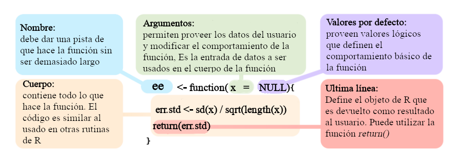
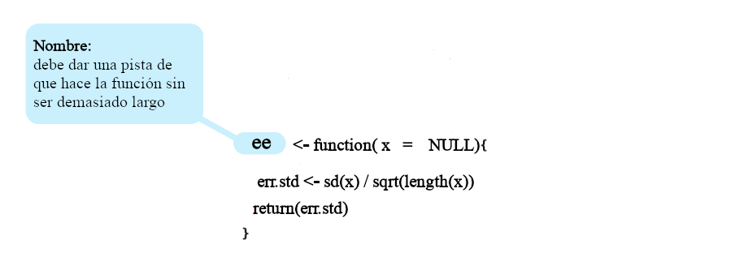
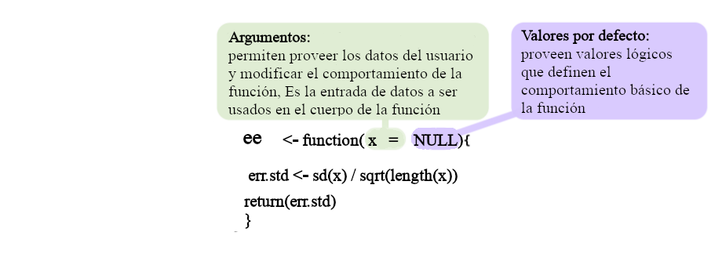
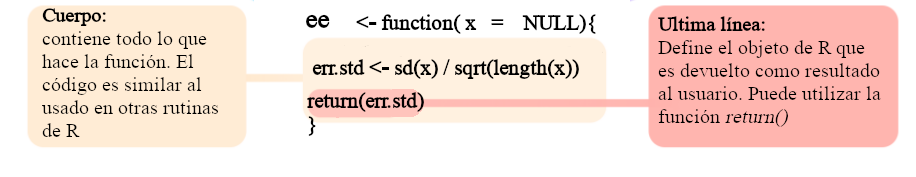

```{=html}
<style>
body
  { counter-reset: source-line 0; }
pre.numberSource code
  { counter-reset: none; }
</style>
```
```{r,echo=FALSE,message=FALSE}

options("digits" = 5)
options("digits.secs" = 3)

# options to customize chunk outputs
knitr::opts_chunk$set(
  class.source = "numberLines lineAnchors", # for code line numbers
  message = FALSE
)
```

::: {.alert .alert-info}
# Objetivo del manual {.unnumbered .unlisted}

-   Identificar los elementos básicos que componen una función

-   Comprender las características de los principales tipos de argumentos en las funciones

-   Ser capaz de construir funciones propias
:::

# Funciones en R

-   Todo lo que sucede en `R` es una llamada de una función (i.e. las manipulaciones y cálculos de objetos en `R` se realizan a través de una función)

-   Una función es una subrutina que tiene como objetivo realizar una tarea específica

-   Permite a los usuarios juntar bloques de código que se usan con frecuencia y, por lo tanto, resulta conveniente encapsular en un objeto que se puede llamar fácilmente cuando sea necesario

-   Las funciones cargadas desde los paquetes (incluido `R` básico) también se pueden modificar y sobrescribir

------------------------------------------------------------------------

# Tipos de funciones

## Funciones integradas

### Funciones básicas

R viene con muchas funciones que puedes usar para hacer tareas sofisticadas:

```{r}
# built in functions
bi <- builtins(internal = FALSE)

length(bi)

```

 

Algunas funciones vienen de forma predeterminada con R básico. Nuevas funciones pueden ser cargadas como parte de paquetes adicionales o incluso creadas por el usuario.

```{mermaid}

flowchart LR
    classDef largeText font-size:18px, padding:15px;

    F(Funciones) --> BF(Funciones Integradas)
    BF --> OP(Operadores)
    BF --> BA(Funciones Básicas)
    F --> PF(Paquetes)
    F --> UF(Funciones Definidas por el Usuario)

    class R,D,D1,D2,F largeText;

    style F fill:#357BA266, stroke:#000, stroke-width:2px, color:#FFF, width:120px
    style BF fill:#A0DFB966, stroke:#000, stroke-width:2px, color:#000
    style BA fill:#DEF5E566, stroke:#000, stroke-width:2px, color:#000
    style OP fill:#DEF5E566, stroke:#000, stroke-width:2px, color:#000    
    style PF fill:#A0DFB966, stroke:#000, stroke-width:2px, color:#000000
    style UF fill:#A0DFB966, stroke:#000, stroke-width:2px, color:#000


```

### Uso de funciones
 
Para usar (o "llamar") una función en `R` se escribe su nombre seguido de paréntesis. Dentro de los paréntesis se colocan los *argumentos* que la función necesita para hacer su trabajo:
 
```
nombre_funcion(argumento1, argumento2, ...)
```
 
Por ejemplo, la función `sqrt()` calcula la raíz cuadrada de un número:
 
```{r}
 
sqrt(16)
 
```
 
 
 
La función `round()` redondea un número decimal a una cantidad determinada de dígitos:
 
```{r}
 
round(3.14159, digits = 2)
 
```
 
 
 
Muchas funciones pueden tomar más de un argumento y también aceptan vectores como entrada (recuerde que `R` está vectorizado):
 
```{r}
 
sum(1:10)
 
mean(c(4, 8, 15, 16, 23, 42))
 
paste("Hola", "mundo")
 
```
 
 
 
No siempre es necesario escribir el nombre de cada argumento al llamar una función; muchas veces basta con el orden en que se escriben ("coincidencia por posición"). Este y otros detalles sobre los argumentos se explican con más detalle en la sección de Argumentos más adelante en este manual. Por ahora basta con saber que la mayoría de las funciones que usaremos ya vienen definidas en `R` y solo es necesario llamarlas con los valores adecuados.
 
::: {.alert .alert-warning}
### Obtener ayuda sobre una función
 
Casi todas las funciones de `R` (incluidas las de paquetes) tienen documentación integrada. Para consultarla se usa `?` seguido del nombre de la función, o la función `help()`:
 
```{r, eval = F}
 
?mean
 
help(mean)
 
```
 
En Rstudio también podemos presionar F1 cuando el cursos está sobre el nombre de la función para acceder a su docmentación.

La ayuda muestra, entre otras cosas, qué argumentos acepta la función, cuáles tienen valores predeterminados y ejemplos de uso, algo que exploraremos con más detalle en las próximas secciones.
:::
 
 

### Operadores

Los operadores son funciones:

```{r}

1 + 1


'+'(1, 1)

2 * 3


'*'(2, 3)


```

 

#### Operadores mas utilizados

Operadores aritméticos:

```{r, echo=F}
d <- data.frame(
c("+" , "suma"),
c("-", 	"resta"),
c("*" ,	"multiplicación"),
c("/",	"división"),
c("^ or **",	"exponente"))


d <- t(d)

colnames(d) <- c("Operador      ", "Descrición  ")

knitr::kable(d, row.names = F, escape = FALSE) |>
  kableExtra::kable_styling(bootstrap_options = c("striped", "hover", "condensed", "responsive"), full_width = FALSE, font_size = 18)

```

 

```{r}

1 - 2

1 + 2

2 ^ 2

2 ** 2

```

 

Operadores lógicos:

```{r, echo=F, results='asis'}
d <- matrix(
c("<", "menor que", "<=", "menor o igual que",">", "mayor que", ">=",	"mayor o igual que", "==", "exactamente igual que", "!=",	"diferente que", "!x",	"No es x", "x | y", "	x O y", "x & y", "x Y y","x %in% y", "correspondencia"), ncol = 2, byrow = TRUE)


d <- as.data.frame(d)

names(d) <- c("Operador      ", "Descrición  ")

knitr::kable(d, row.names = F,  booktabs = TRUE, escape = FALSE) 
# |>
 # kableExtra::kable_styling(bootstrap_options = c("striped", "hover", "condensed", "responsive"), full_width = FALSE, font_size = 18, protect_latex = TRUE)

```

 

```{r}

1 < 2 

1 > 2 

1 <= 2 

1 == 2

1 != 2

1 > 2 

5 %in% 1:6

5 %in% 1:4
```

Los paréntesis utilizados para extraer subconjuntos de objetos también son funciones:

```{r}

letters[3:4]

"["(letters, 3:4)

```

 

::: {.alert .alert-warning}
### Vectorización

La mayoría de las funciones están vectorizadas:

```{r, eval=F}

1:6 * 1:6

```

{width="100%"}

<font size="2">\* Modified from <i>Grolemund & Wickham 2017</i></font>

 

```{r, echo=F}

1:6 * 1:6
```

```{r}

1:6 - 1:6
```

R recicla vectores de longitud desigual:

```{r, eval=F}

1:6 * 1:5

```

{width="100%"}

<font size="2">\* Modified from <i>Grolemund & Wickham 2017</i></font>
:::

 

### Funciones de paquetes adicionales


Estas son funciones que son incluidas en paquetes adicionales que se pueden instalar y cargar en R. Para ser utilizadas el paquete debe ser instalado y cargado. Por ejemplo, para usar la función `viridis()` del paquete "viridis" primero debemos instalarlo. Los paquetes son instalados del servidor de CRAN (Comprehensive R Archive Network) con la función `install.packages()`:
 
```{r}
#| eval: false
 
install.packages("viridis")
 
 
```
 
.. y cargar el paquete:
 
```{r}
 
library(viridis)
 
```
 
Una vez instalado y cargado 'viridis', podemos llamar a la función `viridis()` para generar una paleta de colores:
 
```{r}
 
viridis(5)
 
```
 
Esta función es particularmente útil porque genera paletas de colores perceptualmente uniformes y aptas para personas con daltonismo, algo muy recomendable al graficar datos científicos. Por ejemplo, podemos usarla para colorear las barras de un gráfico:
 
```{r}
 
barplot(1:5, col = viridis(5, alpha = 0.6))
 
```
El uso de paquetes externos es la caracteristica mas util de R ya que permite hacer uso de un número casi infinito de funciones especializadas en diferentes tareas así como de campos muy diversos de la ciencia y la industria.

Podemos explorar los paquetes disponibles para R en [la página de CRAN](https://cran.r-project.org/) (hacer click en el enlace "packages").

::: {.alert .alert-info}
### Ejercicio 1

1.1 Busque un paquete que le interese en CRAN

1.2 Instale el paquete y cárguelo

1.3 Corra el código de ejemplo de una de sus funciones
:::

------------------------------------------------------------------------

# Estructura básica

Todas las funciones son creadas iguales ... mediante la función `function()` y siguen la misma estructura:

```{r, echo=FALSE,out.width="100%", fig.align='center'}


```

<font size="2">\* Modificado de <i>Wickham et al. 2016</i></font>

Podemos observar la estructura de funciones ya cargadas en nuestro entorno de `R`. Para ver el código simplemente corra al nombre de la función en `R` (sin el paréntesis). Por ejemplo, el código de la función `sd()` se puede mostrar de la siguiente manera:

```{r, eval = T}

sd
```

En `Rstudio`, el código también se puede mostrar usando *F2* cuando el cursor está en el nombre de la función.

Además, podemos diseccionar las funciones en sus elementos básicos:

```{r}

# cuerpo
body(sd)

# argumentos
formals(sd)

# ambiente
environment(sd)
```

 

Algunas funciones `R` utilizan funciones primitivas (principalmente escritas en `C`). En estos casos, el código no se muestra:

```{r}
sum

body(sum)

formals(sum)

environment(sum)
```

 

Las funciones son en sí mismas un tipo específico de objeto:

```{r, eval = T}

class(sd)
```

 

Los operadores son funciones:

```{r}

1 + 1


"+"(1, 1)

2 * 3


"*"(2, 3)
```

 

------------------------------------------------------------------------

## Nombre

```{r, echo=FALSE,out.width="100%", fig.align='center'}


```

Los nombres de las funciones tienen pocas restricciones. Siguen las mismas reglas que otros objetos en `R`. Algunas recomendaciones/reglas:

-   No utilice nombres de objetos comunes `R` (por ejemplo, `iris`, `x`) u objetos que ya están en el entorno

-   No use nombres de funciones de uso frecuente (por ejemplo, `mean`)

-   No puede comenzar con un número

-   Debería sugerir lo que hace

-   No debe ser muy largo

En caso de que tenga varias funciones con el mismo nombre, puede llamarlas individualmente utilizando el nombre del paquete (o *namespace*) seguido de `::`:

```{r}
# crear función sd
sd <- function(x) x^10

# no calcula desv. st.
sd(1:5)

# sd
stats::sd(1:5)

# remover nueva sd
rm(sd)

# usar de nuevo
sd(1:5)
```

 

La sintaxis `namespace::function` también se puede usar para llamar a funciones desde paquetes que se han instalado pero que no están cargados en el entorno actual.

 

Las funciones pueden ser anónimas:

```{r}

(function(x) x^10)(1:5)
```

 

Esto es más útil cuando se usan las funciones `Xapply`:

```{r}
l <- list(1:5, 1:4, 1:3)

lapply(l, function(x) x^10)
```

------------------------------------------------------------------------

## Argumentos

```{r, echo=FALSE,out.width="100%", fig.align='center'}


```

 

Permiten a los usuarios ingresar objetos en la función. Los valores proporcionados en los argumentos son utilizados en el cuerpo de la función para hacer los cálculos necesarios.

```{mermaid}

flowchart LR
    classDef largeText font-size:18px, padding:15px;

    A(Argumentos) --> B(Tarea)
    subgraph Cuerpo
    B --> C("Enunciado de retorno\nreturn()")
    end
    C --> D(Resultado)

    style A fill:#38AAAC80, stroke:#000, stroke-width:2px, color:#FFF
    style B fill:#BEBEBE1A, stroke:#000, stroke-width:0.5px, color:#FFF
    style C fill:#BEBEBE1A, stroke:#000, stroke-width:0.5px, color:#FFF
    style D fill:#BEBEBE1A, stroke:#000, stroke-width:0.5px, color:#FFF
    style Cuerpo fill:#BEBEBE1A

```

Los argumentos pueden o no tener valores predeterminados. Cuando los argumentos tienen valores predeterminados, no es necesario proporcionarlos:

```{r eval = T}

f1 <- function(x, y = 2) x + y

f1(1)
```

 

Por supuesto, se pueden modificar:

```{r eval = T}

f1(3, 4)
```

 

Los argumentos sin valor predeterminado deben ser proporcionados:

```{r error = T}

f1()
```

 

Si todos los argumentos tienen un valor predeterminado, se puede invocar la función sin proporcionar ningún argumento:

```{r eval = T}

f1 <- function(x = -2, y = 2) x + y

f1()
```

 

Ese es el caso de `dev.off()` y `Sys.time()`:

```{r eval = T}

Sys.time()
```

 

Los argumentos pueden especificarse implícitamente por posición o por nombres incompletos:

```{r}

f2 <- function(a1, b1, b2) {
  list(a1 = a1, b1 = b1, b2 = b2)
}

# por posicion
str(f2(1, 2, 3))

# por posicion y nombre
str(f2(a = 1, 2, 3))


str(f2(1, a = 2, 3))


str(f2(1, 2, a = 3))

# por posicion y nombre parcial
str(f2(1, a = 2, b1 = 3))
```

 

Sin embargo, esto no funciona si los nombres son ambiguos:

```{r, error=T}

f2(b = 1, 2, a = 3)
```

 

Es más seguro (y, por lo tanto, una mejor práctica) usar los nombres completos de los argumentos.

 

Las funciones también pueden tomar argumentos lógicos. Estos son útiles para modificar el comportamiento de la función para que coincida con diferentes escenarios. Por ejemplo, `mean()` permite a los usuarios ignorar los *NA*:

```{r}
v1 <- c(1, 2, 3, NA)

# sin ignorar NAs
mean(v1, na.rm = FALSE)

# ignorando NAs
mean(v1, na.rm = TRUE)
```

 

::: {.alert .alert-info}
## Ejercicio 2

2.1 ¿Qué hace la función `cor.test()`?

2.2 Úsela con "Sepal.Length" y "Sepal.Width" de los datos de ejemplo *iris* (use `data(iris)`)

2.3 ¿Qué argumentos deben proporcionarse?

2.4 ¿Qué hace el argumento *alternative*? Use diferentes valores para este argumento y compare los resultados

2.5 ¿Cómo se puede calcular la correlación de Spearman?

2.6 ¿Cómo puede obtener el valor de **p** directamente del resultado de la función (sin guardar el resultado como un objeto)?

2.7 Escoga una función de R y lea su documentación con el fin de entender su uso, cada uno de sus argumentos (y que tipo de objetos requieren) y el resultado que produce (es probable que se le pida que explique esto al grupo)
:::

------------------------------------------------------------------------

## Cuerpo

```{r, echo=FALSE,out.width="100%", fig.align='center'}


```

El cuerpo de una función puede contener:

-   Comprobación de argumentos

-   Manipulación de datos

-   Definición de resultados

El cuerpo de la función puede tomar el mismo tipo de código utilizado en cualquier rutina de `R`. Sin embargo, los objetos creados no estarán disponibles en el entorno.

```{mermaid}

flowchart LR
    classDef largeText font-size:18px, padding:15px;

    A(Argumentos) --> B(Tarea)
    subgraph Cuerpo
    B --> C("Enunciado de retorno\nreturn()")
    end
    C --> D(Resultado)

    style A fill:#A0DFB980, stroke:#000, stroke-width:0.5px
    style B fill:#38AAAC80, stroke:#000, stroke-width:2px
    style C fill:#38AAAC80, stroke:#000, stroke-width:2px
    style D fill:#BEBEBE1A, stroke:#000, stroke-width:0.5px
    style Cuerpo fill:#DEF5E54D
    
     
```

Cuando se realizan varios cálculos, debemos incluir una *declaración de retorno* (return statement), que define explícitamente la salida de la función. Esto se hace usando la función `return()`:

```{r}
# sin "return statement"
f1 <- function(x, y) {
  z1 <- 2 * x + y
  z2 <- x + 2 * y
  z3 <- 2 * x + 2 * y
  z4 <- x / y
}

f1(5, 3)

f1_out <- f1(5, 3)

f1_out


# con "return statement"
f2 <- function(x, y) {
  z1 <- 2 * x + y
  z2 <- x + 2 * y
  z3 <- 2 * x + 2 * y
  z4 <- x / y

  return(c(z1, z2, z3, z4))
}

f2(5, 3)

f2_out <- f2(5, 3)

f2_out
```

 

Por lo tanto, cuando no se proporciona una *declaración de retorno*, la función devolverá el último objeto que se creó en el cuerpo de la función:

```{r}
# sin "return statement"
f3 <- function(x, y) {
  z1 <- 2 * x + y
  z2 <- x + 2 * y
  z3 <- 2 * x + 2 * y
  z4 <- x / y

  c(z1, z2, z3, z4)
}

f3(5, 3)

f3_out <- f3(5, 3)

f3_out
```

 

Es más seguro usar `return()`.

 

Cuando una función realiza varias tareas, podemos usar una lista para juntar los diferentes objetos. Esto es particularmente útil cuando se generan objetos de diferentes clases (por ejemplo, vectores y listas):

```{r}

f4 <- function(x, y) {
  # 1 elemento
  z1 <- x + y

  # 2 elementos
  z2 <- c(x, y / 3)

  # vector logico
  z3 <- z2 < 10


  l <- list(z1, z2, z3)

  return(l)
}

f4(10, 5)
```

 

Podemos acceder a elementos específicos de la salida de una función mediante indexación:

```{r}
# elemento 1
f4(10, 5)[[1]]

# elemento 2
f4(10, 5)[[2]]

# elemento 3
f4(10, 5)[[3]]
```

 

Por supuesto, también podemos guardar el resultado como un objeto y acceder a cada elemento mediante la indexación:

```{r}

# elemento 1
out <- f4(10, 5)

# elemento 1
out[[1]]

# elemento 2
out[[2]]
```

 

::: {.alert .alert-info}
## Ejercicio 3

3.1 Cree una función llamada `promedio` que calcule el promedio de un vector numérico. Internamente solo puede utilizar las funciones `sum()` y `length()` (suma y división, no puede llamar la función `mean()`)

3.2 Cree una función que tome 2 argumentos numéricos (llámelos 'x' y 'y'), eleve cada uno al cuadrado y luego los sume

3.3 Agregue valores predeterminados a cada argumento

3.4 Ejecute la función usando los valores predeterminados

3.5 Ejecute la función usando un valor predeterminado y uno proporcionado

3.6 Ejecute la función proporcionando ambos valores
:::

 

------------------------------------------------------------------------

# Argumentos lógicos

Son argumentos que pueden tomar solo dos valores: `TRUE` o `FALSE`. Estos argumentos permiten modificar el comportamiento de la función de forma binaria: si es `TRUE` llevaría a cabo la tarea 1 y si es `FALSE` llevaría a cabo la tarea 2. Internamente (i.e. en el cuerpo de las función) estas funciones implican el uso del operador `if`, algunas veces incluyendo su contra-parte `else`. Estos operadores son parte fundamental de la programación y se usan para definir que acción ejecutar con base en una evaluación lógica:

```{r}

# creemos un valor que represente un argumento logico
valor_logico <- TRUE

# utilizamos un operador if
if (valor_logico) {
  print("se ejecuta la accion 1")
}

# ir ahora un if + else
if (valor_logico) {
  print("se ejecuta la accion 1")
} else {
  print("se ejecuta la accion 2")
}

# cuando es FALSE
valor_logico <- FALSE

if (valor_logico) {
  print("se ejecuta la accion 1")
} else {
  print("se ejecuta la accion 2")
}

```

 

La parte dentro de los paréntesis justo después de `if` es la evaluación lógica.

Estos operadores son utilizados en el cuerpo de la función cuando esta lleva un argumento lógico.

```{mermaid}

flowchart LR
    classDef largeText font-size:18px, padding:15px;

    A(Argumento lógico) --> B(Evaluación)
    subgraph Cuerpo
    B -- verdadero --> C(Tarea 1)
    B -- falso --> D(Tarea 2)
    C --> E("Enunciado de retorno\nreturn()")
    D --> E
    end
    E --> F(Resultado)

    style A fill:#A0DFB980, stroke:#000, stroke-width:2px
    style B fill:#38AAAC80, stroke:#000, stroke-width:2px
    style C fill:#38AAAC80, stroke:#000, stroke-width:2px
    style D fill:#40498E80, stroke:#000, stroke-width:2px
    style E fill:#40498E4D, stroke:#000, stroke-width:2px
    style F fill:#BEBEBE1A, stroke:#000, stroke-width:0.5px
    style Cuerpo fill:#DEF5E54D
    
```

Por ejemplo, la siguiente función utiliza un argumento lógico para decidir si la operación algebraica a realizar es una suma o un promedio:

```{r}
mean_sum <- function(x, y, prom = FALSE) {
  if (prom) {
    b <- mean(c(x, y))
  } else {
    b <- sum(c(x, y))
  }

  return(b)
}
```

 

Note que este tipo de argumentos deben tener un valor predeterminado. Podemos probar la función de la siguiente forma:

```{r}

mean_sum(x = 2, y = 3)
```

 

::: {.alert .alert-info}
## Ejercicio 4

4.1 Cree una función que tome 3 argumentos numéricos, multiplíquelos y luego calcule el logaritmo natural del resultado (función `log()`)

4.2 Agregue valores predeterminados a cada argumento

4.3 Ejecute la función con uno de los argumentos con un número negativo. ¿Qué pasa? ¿Por qué?

4.4 Agregue un argumento lógico que permita a los usuarios (si lo desean) convertir los argumentos de entrada a su valor absoluto (usando la función `abs()`). Agregue las modificaciones necesarias para que la función haga los cálculos con y sin valores absolutos.

```{r, eval = F, echo = F}
# a)
fcn_1 <- function(a, b, c) log(a * b * c)

fcn_1(1, 4, 12)

# b)
fcn_1 <- function(a = 1, b = 2, c = 3) log(a * b * c)

# c)
fcn_1(1, 2, -1)
```
:::

------------------------------------------------------------------------

# Ventajas de usar funciones

## Código mas limpio

Los objetos creados dentro del cuerpo no están disponibles en el entorno actual:

```{r}
# primero remover todo los objetos
rm(list = ls())

f5 <- function(x) {
  sqr <- x * x
  lg_sqr <- log(x)
  return(lg_sqr)
}

f5(7)

exists("sqr")
exists("lg_sqr")
```

 

```{r}

x <- 7
sqr <- x * x
lg_sqr <- log(x)


exists("sqr")
exists("lg_sqr")
```

 

## Facil de correr y compartir

Se pueden invocar funciones desde archivos de `R` externos sin estar definidas en el código actual con la función `source()`. En este ejemplo creamos la función `fnctn_X`:

```{r}

fnctn_X <- function(sq_mt, vctr) {
  # trasponer matriz y calcular est dev
  stp1 <- t(sq_mt)
  stp2 <- vctr * vctr

  # guardar en lista
  rslt <- list(stp1, stp2)
  return(rslt)
}

fnctn_X(sq_mt = cbind(c(1, 2), c(3, 4)), vctr = c(2, 3))
```

 

Guarde el código anterior en un archivo `R` llamado 'function_X.R'. Ahora la función se puede cargar usando `source()`:

```{r, eval = F}

# removamosla del ambiente
rm(fnctn_X)

# cargar funcion
source("function_X.R")

# run it
fnctn_X(sq_mt = cbind(c(1, 2), c(3, 4)), vctr = c(2, 3))
```

```{r, eval=T, echo=F}

fnctn_X(sq_mt = cbind(c(1, 2), c(3, 4)), vctr = c(2, 3))
```

 

Además, este código se puede compartir fácilmente. Se puede enviar por correo electrónico o publicar en línea. Incluso se puede cargar desde repositorios en línea:

```{r, error=T}

# remover objetos
rm(list = ls())

# revisar si existe en ambiente actual
exists("fnctn_X")

# cargar desde el internet
source(
  paste0(
    "https://raw.githubusercontent.com/maRce10/",
    "r_avanzado_2023/master/data/function_x.r"
  )
)


# revisar si existe en ambiente actual
exists("fnctn_X")
```

 

## Se aplica fácilmente a nuevos objetos

Esto ya debería ser obvio a este punto.

## Otros consejos

-   Construir funciones cortas:
    -   Fácil de leer
    -   Fácil de arreglar y actualizar
    -   Si es demasiado largo, probablemente debería dividirse en varias funciones
    -   Genera modularidad
-   Añadir comentarios a todo el código  
-   Agregar descripciones a cada uno de los argumentos que toma  
-   Función de prueba con diferentes valores/escenarios

------------------------------------------------------------------------

::: {.alert .alert-info}
## Ejercicio 5

5.1 Cree una función que calcule el promedio, la desviación estándar y el error estándar de un vector numérico. Estos valores deben ser devueltos como una lista con nombres.

5.2 Permita a los usuarios ignorar los `NAs` (similar al argumento `na.rm` en `mean()`, pista: añada un argumento lógico, puede utilizar la funcion `na.omit()`)

5.3 Haga que la función además produzca un histograma del vector numérico proporcionado por el usuario

5.4 Haga que la función permita al usuario definir el color para las barras del histograma

5.5 Añada un argumento a la función que permita el usuario, si lo desea, calcular la sumatoria (`sum()`) junto con el resto de los descriptores estadísticos

5.6 Agregue el promedio y la desviación estándar al título del histograma (pista: use `paste()`)

5.7 Modifique la función para que también cree una linea vertical indicando el promedio del vector numérico proporcionado por el usuario (pista `abline()`)

5.8 Modifique la función para que añada un polígono transparente sobre el área que cubre el promedio +/- la desviación estándar (puede usar la función `rect()`)

5.9 Modifique la función con un argumento lógico que permita al usuario controlar si se crea un gráfico o no
:::

 

------------------------------------------------------------------------

## Lecturas adicionales

-   <a href="http://nicercode.github.io/intro/writing-functions.html"> Introduction to R guide to writing functions with information for a total beginner</a>

-   <a href="https://twitter.com/hadleywickham">Information on functions for intermediate and advanced users (Hadley Wickham)</a>.

-   <a href="http://cran.r-project.org/doc/manuals/R-intro.html#Writing-your-own-R-intro.html#Writing-your-own-functions">The official R intro material on writing your own functions</a> (ir a "Writing your own function")

------------------------------------------------------------------------

## Referencias

-   Wickham, Hadley, and Garrett Grolemund. 2016. *R for data science: import, tidy, transform, visualize, and model data*. [website](http://r4ds.had.co.nz)

---


::: {.callout-note collapse="true"}
## Información de la sesión {.unnumbered .unlisted}

```{r session info}
#| echo: false

# if devtools is installed use devtools::session_info()
if (requireNamespace("devtools", quietly = TRUE)) {
  devtools::session_info()
} else {
  sessionInfo()
}
```
:::