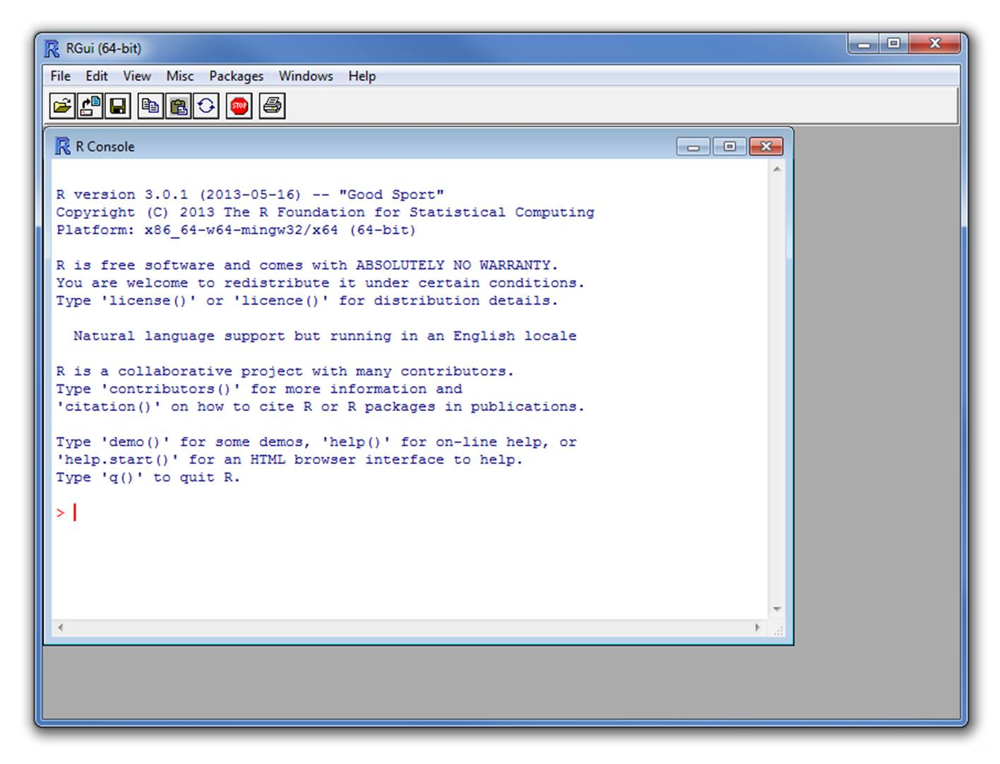
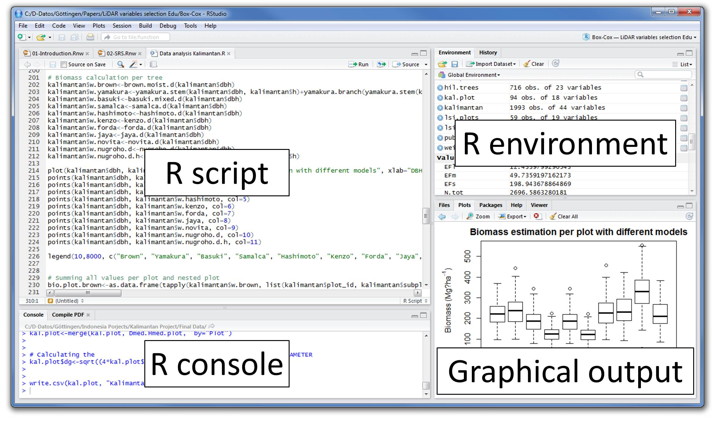
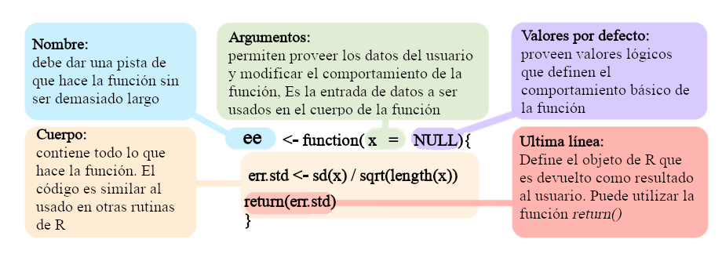
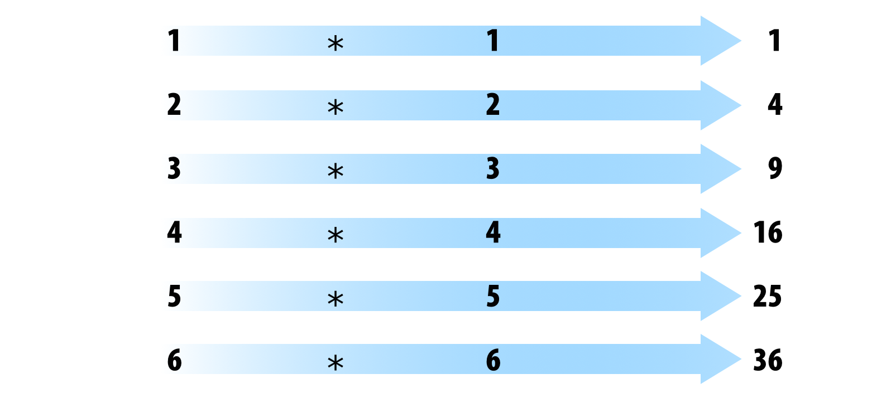
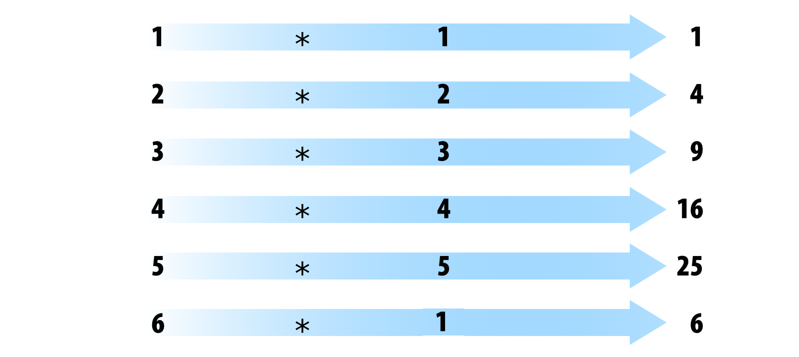
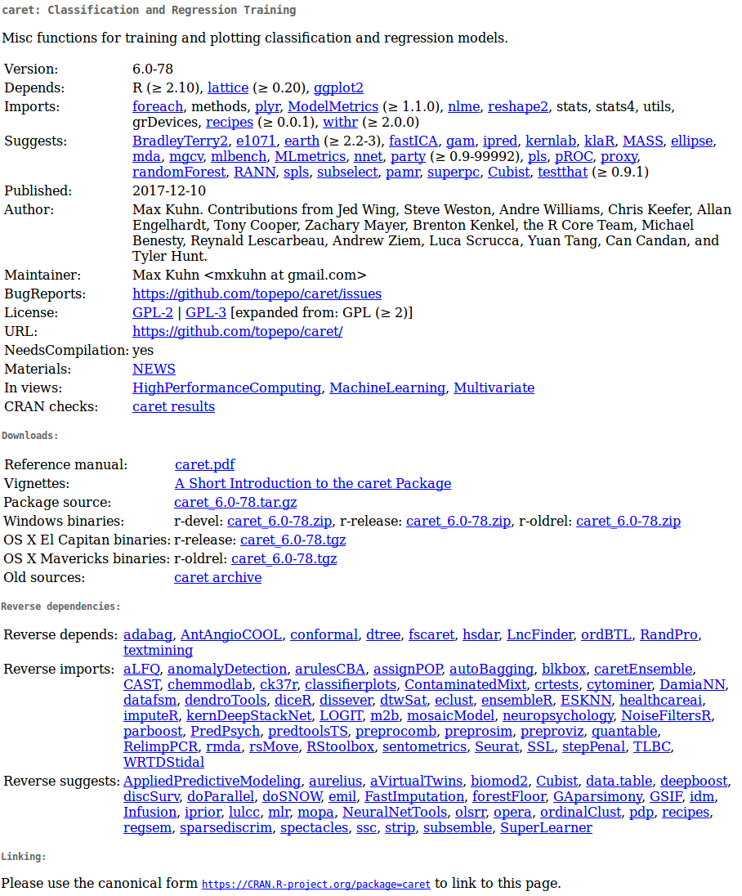
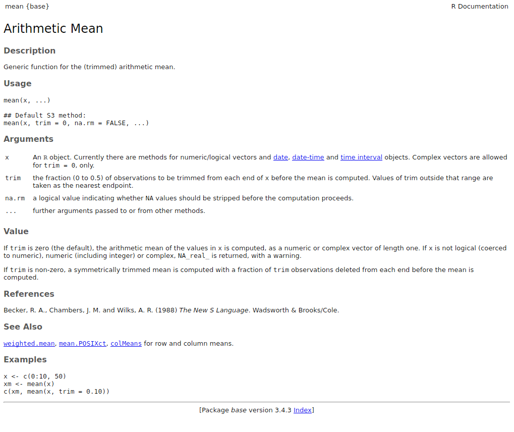

```{r,echo=FALSE,message=FALSE}

options("digits"=5)
options("digits.secs"=3)

# options to customize chunk outputs
knitr::opts_chunk$set(
  message = FALSE
 )

```

::: {.alert .alert-info}
# Objetivo del manual {.unnumbered .unlisted}

- Familiarizarse con los bloques básicos en R y su manipilación

- Conocer las fuentes principales de documentación estandarizada en R
:::

 

# ¿Qué es R?

- Un [Lenguaje de Dominio Específico (DSL)](https://en.wikipedia.org/wiki/Domain-specific_language) libre para la estadística y el análisis de datos
- Una colección de más de 21145 paquetes (al 12 de agosto de 2024)
- Una comunidad grande y activa en la industria y el mundo académico
- Una forma de hablar "directamente" con su ordenador

Históricamente:

- Basado en el lenguaje de programación S
- Alrededor de 20 años de antigüedad (el linaje data de 1975 - hace casi 40 años)

{width="100%"}

 

# Rstudio

Entorno de desarrollo integrado (IDE) para R. Incluye:

- Una consola
- Editor para resaltar la sintaxis que soporta la ejecución directa del código
- Herramientas para el trazado, el historial, la depuración y la gestión del espacio de trabajo

{width="100%"}

##  

```{r paleta}
#| eval: false
#| echo: false

 [1] "#0B040566" "#28192F66" "#3B2F5E66" "#40498E66"
 [5] "#366A9F66" "#348AA666" "#38AAAC66" "#54C9AD66"
 [9] "#A0DFB966" "#DEF5E566"

```

# Elementos del lenguaje R

En R todo lo que existe es un objeto y los objetos se pueden clasificar a grosso modo en **objetos que contienen datos** y objetos que realizan tareas, mejor conocidos como **funciones**:

```{mermaid}

flowchart LR
    classDef largeText font-size:18px, padding:15px;

    R(Objetos en R) --> D(Objetos de Datos)
    D --> D1(1 dimension)
    D --> D2(2 dimensiones)
    D --> DN(N dimensiones)
    R --> F(Funciones)
    
    D1 --> V(Vector)
    D1 --> L(Lista)
    D2 --> M(Matriz)
    D2 --> DF("Cuadro de Datos <br>(Data Frame)")
    DN --> AR("Arreglo <br>(Array)")

    F --> BF(Funciones Integradas)
    BF --> BA(Funciones Básicas)
    BF --> OP(Operadores)
    F --> PF(Paquetes)
    F --> UF(Funciones Definidas por el Usuario)

    class R,D,D1,D2,F largeText;

    style R fill:#28192F66, stroke:#000, stroke-width:2px, color:#FFF, width:140px
    style D fill:#40498E66, stroke:#000, stroke-width:2px, color:#FFF, width:180px
    style D1 fill:#348AA666, stroke:#000, stroke-width:2px, color:#FFF, width:140px
    style D2 fill:#348AA666, stroke:#000, stroke-width:2px, color:#FFF, width:140px
    style DN fill:#348AA666, stroke:#000, stroke-width:2px, color:#FFF, width:140px
    style F fill:#357BA266, stroke:#000, stroke-width:2px, color:#FFF, width:120px
    style DF fill:#49C1AD66, stroke:#000, stroke-width:2px, color:#000
    style AR fill:#49C1AD66, stroke:#000, stroke-width:2px, color:#000
    style V fill:#49C1AD66, stroke:#000, stroke-width:2px, color:#000
    style M fill:#49C1AD66, stroke:#000, stroke-width:2px, color:#000
    style L fill:#49C1AD66, stroke:#000, stroke-width:2px, color:#000
    style BF fill:#A0DFB966, stroke:#000, stroke-width:2px, color:#000
    style BA fill:#DEF5E566, stroke:#000, stroke-width:2px, color:#000
    style OP fill:#DEF5E566, stroke:#000, stroke-width:2px, color:#000    
    style PF fill:#A0DFB966, stroke:#000, stroke-width:2px, color:#000000
    style UF fill:#A0DFB966, stroke:#000, stroke-width:2px, color:#000


```

Para sentirse cómodo programando en R en necesario saber en todo momento con que tipo de objetos estamos trabajando. Las funciones `class()` y `str()` nos permiten evaluar la estrucutra de los objetos. Las estaremos usando repetidamente en este tutorial.  

## Objetos que contienen datos

La estructura de datos básica en R es el vector. Con este se contruyen todas las otras clases de objetos. Para entender las clases es útil pensar en el número de dimensiones (1, 2 o mas) y tipos de datos que pueden contener: homogéneos (un único tipo de elemento) o homogéneos (o múltiples tipos de elementos).

```{mermaid}

flowchart LR
    classDef largeText font-size:18px, padding:15px;

    D(Objetos de Datos) --> D1(1 dimension)
    D --> D2(2 dimensiones)
    D1 --> V(Vector)
    D1 --> L(Lista)
    D2 --> M(Matriz)
    D2 -->  DF("Cuadro de Datos <br>(Data Frame)")

    style D fill:#40498E66, stroke:#000, stroke-width:2px, color:#FFF, width:180px
    style D1 fill:#348AA666, stroke:#000, stroke-width:2px, color:#FFF, width:140px
    style D2 fill:#348AA666, stroke:#000, stroke-width:2px, color:#FFF, width:140px
    style DF fill:#49C1AD66, stroke:#000, stroke-width:2px, color:#000
    style V fill:#49C1AD66, stroke:#000, stroke-width:2px, color:#000
    style M fill:#49C1AD66, stroke:#000, stroke-width:2px, color:#000
    style L fill:#49C1AD66, stroke:#000, stroke-width:2px, color:#000


```

```{r, echo=FALSE}
d <- data.frame(
 	c("Vector atómico", "Lista"),
	c("Matriz", "Cuadro de datos (data frame)"),
c("arreglo (Array)", ""))


d <- t(d)

colnames(d) <-c("Homogéneo",	"Heterogéneo")

rownames(d) <-c("1d",	"2d", "nd")

as.data.frame(d)

```

### Objetos de 1 dimensión

Hay dos tipos básicos de vectores: vectores atómicos y listas.

Tienen tres propiedades comunes:

- Tipo, `typeof()` (clase/modo \~)
- Longitud, `length()` (número de elementos)
- Attributes, `attributes()` (metadatos)

Se diferencian en los tipos de sus elementos: todos los elementos de un vector atómico deben ser del mismo tipo, mientras que los elementos de una lista pueden tener diferentes tipos.

#### Vectores atomicos

Tipos de vectores atómicos:

- Lógico [(booleano)](https://en.wikipedia.org/wiki/Boolean)
- Entero
- Numérico (doble)
- Caracteres
- Factores

Los vectores se construyen con la función `c()`, Pueden ser numérico:

```{r}
x <- 1
x1 <- c(1)

all.equal(x, x1)

class(x)
```

De caracteres:

```{r}
y <- "algo"

class(y)
```

Lógico:

```{r}
z <- TRUE

class(z)
```

O factor:

```{r}
q <- factor(1)

class(q)

```

 

Por tanto, los números o cadenas individuales son en realidad vectores de longitud uno:

```{r}

class(1)

class("a")
```

Los vectores sólo pueden contener elementos del mismo tipo. Los tipos diferentes de elementos serán forzados al tipo más flexible:

```{r}

x <- c(1, 2, "a")

x

class(x)

```

 

Los valores que faltan se especifican con NA, que es un vector lógico de longitud 1. NA siempre será interpretado al tipo correcto si se utiliza dentro de `c()`:

```{r}

v <- c(10, 11, NA)

class(v)

v <- c("a", "b", NA)

class(v)

```

::: {.alert .alert-warning}
#### Factores

Los vectores con factores son muy simulares a los de caracteres. Sin embargo, un factor sólo puede contener valores predefinidos, conocidos como niveles. Los atributos se utilizan para definir los niveles del factor.

Los factores se construyen sobre vectores enteros utilizando dos atributos:

- clase "factor": hace que se comporten de forma diferente a los vectores de caracteres normales
- niveles: define el conjunto de valores permitidos

```{r}

x <- factor(c("a", "b", "b", "a"))
x

levels(x)


str(x)

```

 

Los factores parecen vectores de caracteres, pero en realidad son números enteros:

```{r}

x <- factor(c("a", "b", "b", "a"))

c(x)
```
:::

#### Listas

Puede contener objetos de diferentes clases y tamaños. Las listas se construyen con list():

```{r}

l <- list("a", 1, FALSE)

l

class(l)

str(l)

```

En realidad pueden ser vistas como cajones donde se pueden poner cualquier otro tipo de objeto:

```{r}

l <- list(c("a", "b"), c(1, 2, 3, 4), c(FALSE, TRUE, FALSE))

l

str(l)

```

### Objetos de 2 dimensiones

### Matrices

Todas los elementos son del mismo tipo:

```{r}
m <- matrix(c(1, 2, 3, 11, 12, 13), nrow = 2)

dim(m)

m

class(m)


m <- matrix(c(1, 2, 3, 11, 12, "13"), nrow = 2)
m


```

 

### Cuadros de datos (data frames)

Caso especial de las listas. Puede contener elementos de diferentes tipos:

```{r}

m <-
  data.frame(
    ID = c("a", "b", "c", "d", "e"),
    size = c(1, 2, 3, 4, 5),
    observed = c(FALSE, TRUE, FALSE, FALSE, FALSE)
  )

dim(m)

m

class(m)

is.data.frame(m)

is.list(m)

str(m)

```

 

Pero los vectores deben tener la misma longitud:

```{r, error = TRUE}

m <-
  data.frame(
    ID = c("a", "b", "c", "d", "e"),
    size = c(1, 2, 3, 4, 5, 6),
    observed = c(FALSE, TRUE, FALSE, FALSE, FALSE)
  )

```

 

::: {.alert .alert-info}
### Ejercicio 1

 

- Cree un vector numérico con 8 elementos que contenga números positivos y negativos

- Cree un vector de caracteres con los nombres de las provincias de Costa Rica

- Añada al vector de punto anterior un NA

- Cree una matriz numérica con 3 columnas y 3 filas

- Cree una matriz de caracteres con 4 columnas y 3 filas

- ¿Qué tipo de objeto es 'iris' y cuales son sus dimensiones? (pista: `iris` es un objeto disponible por omisión en su ambiente)

- Cree un cuadro de datos (data frame) con una columna numérica, una columna de caracteres y una columna con factores
:::

 

## Funciones: objetos que hacen tareas

Todas las funciones se crean con la función `function()` y siguen la misma estructura:

{width="100%"}

<font size="2">\* Modified from <i>Grolemund 2014</i></font>  

### Funciones integradas

#### Funciones básicas

R viene con muchas funciones que puedes usar para hacer tareas sofisticadas:

```{r}
# built in functions
bi <- builtins(internal = FALSE)

length(bi)

```

 

Algunas funciones vienen de forma predeterminada con R básico. Nuevas funciones pueden ser cargadas como parte de paquetes adicionales o incluso creadas por el usuario.

```{mermaid}

flowchart LR
    classDef largeText font-size:18px, padding:15px;

    F(Funciones) --> BF(Funciones Integradas)
    BF --> OP(Operadores)
    BF --> BA(Funciones Básicas)
    F --> PF(Paquetes)
    F --> UF(Funciones Definidas por el Usuario)

    class R,D,D1,D2,F largeText;

    style F fill:#357BA266, stroke:#000, stroke-width:2px, color:#FFF, width:120px
    style BF fill:#A0DFB966, stroke:#000, stroke-width:2px, color:#000
    style BA fill:#DEF5E566, stroke:#000, stroke-width:2px, color:#000
    style OP fill:#DEF5E566, stroke:#000, stroke-width:2px, color:#000    
    style PF fill:#A0DFB966, stroke:#000, stroke-width:2px, color:#000000
    style UF fill:#A0DFB966, stroke:#000, stroke-width:2px, color:#000


```

#### Operadores

Los operadores son funciones:

```{r}

1 + 1


'+'(1, 1)

2 * 3


'*'(2, 3)


```

 

##### Operadores mas utilizados

Operadores aritméticos:

```{r, echo=F}
d <- data.frame(
c("+" , "suma"),
c("-", 	"resta"),
c("*" ,	"multiplicación"),
c("/",	"división"),
c("^ or **",	"exponente"))


d <- t(d)

colnames(d) <- c("Operador      ", "Descrición  ")

knitr::kable(d, row.names = F, escape = FALSE) |>
  kableExtra::kable_styling(bootstrap_options = c("striped", "hover", "condensed", "responsive"), full_width = FALSE, font_size = 18)

```

 

```{r}

1 - 2

1 + 2

2 ^ 2

2 ** 2

```

 

Operadores lógicos:

```{r, echo=F, results='asis'}
d <- matrix(
c("<", "menor que", "<=", "menor o igual que",">", "mayor que", ">=",	"mayor o igual que", "==", "exactamente igual que", "!=",	"diferente que", "!x",	"No es x", "x | y", "	x O y", "x & y", "x Y y","x %in% y", "correspondencia"), ncol = 2, byrow = TRUE)


d <- as.data.frame(d)

names(d) <- c("Operador      ", "Descrición  ")

knitr::kable(d, row.names = F,  booktabs = TRUE, escape = FALSE) 
# |>
 # kableExtra::kable_styling(bootstrap_options = c("striped", "hover", "condensed", "responsive"), full_width = FALSE, font_size = 18, protect_latex = TRUE)

```

 

```{r}

1 < 2 

1 > 2 

1 <= 2 

1 == 2

1 != 2

1 > 2 

5 %in% 1:6

5 %in% 1:4
```

Los paréntesis utilizados para extraer subconjuntos de objetos también son funciones:

```{r}

letters[3:4]

"["(letters, 3:4)

```

 

::: {.alert .alert-warning}
### Vectorización

La mayoría de las funciones están vectorizadas:

```{r, eval=F}

1:6 * 1:6

```

{width="100%"}

<font size="2">\* Modified from <i>Grolemund & Wickham 2017</i></font>

 

```{r, echo=F}

1:6 * 1:6
```

```{r}

1:6 - 1:6
```

R recicla vectores de longitud desigual:

```{r, eval=F}

1:6 * 1:5

```

{width="100%"}

<font size="2">\* Modified from <i>Grolemund & Wickham 2017</i></font>
:::

 

### Funciones de paquetes adicionales

Estas son funciones que son incluidas en paquetes adicionales que se pueden instalar y cargar en R. Para ser utilizadas el paquete debe ser instalado y cargado.Por ejemplo para usar la función `corTest` del paquete "psych" primero debemos instalar. Los paquetes son instalados del servidor de CRAN (Comprehensive R Archive Network) con la función `install.packages()`:

```{r}
#| eval: false

install.packages("psych")


```

.. y cargar el paquete:

```{r}

library(psych)

```

Una vez instalado y cargado 'psych', podemos llamar a la función `corTest`:

```{r}

corTest(iris$Sepal.Length, iris$Sepal.Width)

```

El uso de paquetes externos es la caracteristica mas util de R ya que permite hacer uso de un número casi infinito de funciones especializadas en diferentes tareas así como de campos muy diversos de la ciencia y la industria.

Podemos explorar los paquetes disponibles para R en [la página de CRAN](https://cran.r-project.org/) (hacer click en el enlace "packages").

::: {.alert .alert-info}
### Ejercicio 2

 

- Busque un paquete que le interese en CRAN

- Instale el paquete y carguelo

- Corra el codigo de ejemplo de una de sus funciones
:::

# Manipulación de objetos

## Extraer subconjuntos usando indexación (indexing)

Los elementos dentro de los objetos pueden ser llamados por medio de la indexación. Para sub-conjuntar un vector simplemente llame a la posición del objeto usando corchetes:

```{r}

x <- c(1, 3, 4, 10, 15, 20, 50, 1, 6)

x[1]

x[2]

x[2:3]

x[c(1,3)]

```

 

Los elementos se pueden eliminar de la misma manera:

```{r}


x[-1]

x[-c(1,3)]

```

 

Las matrices y los marcos de datos requieren 2 índices `[fila, columna]`:

```{r}

m <- matrix(c(1, 2, 3, 11, 12, 13), nrow = 2)

m[1, ]

m[, 1]

m[1, 1]

m[-1, ]

m[, -1]

m[-1, -1]


df <- data.frame(
  provincia = c("San José", "Guanacaste", "Guanacaste"), 
  canton = c("Montes de Oca", "Nicoya", "Liberia"), 
	distrito = c("San Rafael", "Nosara", "Nacascolo")
  )

df

df[1, ]

df[, 1]

df[1, 1]

df[-1, ]

df[, -1]

df[-1, -1]

df[,"provincia"]

df[,c("provincia", "canton")]

```

 

Las listas requieren 1 índice entre dobles corchetes `[[índice]]`:

```{r}

l <- list(c("a", "b"),
          c(1, 2, 3),
          c(FALSE, TRUE, FALSE, FALSE))

l[[1]]

l[[3]]

```

 

Los elementos dentro de las listas también pueden ser subconjuntos en la misma cadena de código:

```{r}

l[[1]][1:2]

l[[3]][2]

```

 

## Explorar objectos

Las siguientes funciones de R básico (predeterminadas) nos pueden ayudar a explorar la estructura de los objetos:

```{r, eval = TRUE}

str(df)

names(df)

dim(df)

nrow(df)

ncol(df)

head(df)

tail(df)

table(df$provincia)

class(df)

```

```{r, eval = F}

View(df)

```

 

::: {.alert .alert-info}
## Ejercicio 3

 

- Utilice los datos de ejemplo `iris` para crear un subconjunto de datos con sólo las observaciones de la especie `setosa`

- Ahora cree un subconjunto de datos que contenga las observaciones tanto de "setosa" como de "versicolor"

- También con `iris` cree un subconjunto de datos con las observaciones para las que `iris$Sepal.length` es mayor que 6

- ¿Cuántas observaciones tienen una longitud de sépalo superior a 6?
:::

##  

# El estilo importa

<font size="2"><a href="https://google.github.io/styleguide/Rguide.xml">Based on google's R Style Guide</a></font>

## Nombres de archivos

Los nombres de los archivos deben terminar en .R y, por supuesto, ser auto-explicatorios:

- Bien: graficar_probabilidad_posterior.R
- Mal: graf.R

## Nombres de objetos

Variables y funciones:

- Minúsculas
- Utilice un guión bajo
- En general, nombres para las variables y verbos para las funciones
- Procure que los nombres sean concisos y significativos (no siempre es fácil)
- Avoid using names of existing functions of variables

```{r, eval=F}

  - Bien: dia_uno: dia_1, peso_promedio(),
  
  - Mal: diauno, dia1, primer.dia_delmes
```

 

## Syntaxis

### Espacios

- Utilice espacios alrededor de los operadores y para los argumentos dentro de una función
- Ponga siempre un espacio después de una coma, y nunca antes (como en el inglés normal)
- Coloque un espacio antes del paréntesis izquierdo, excepto en una llamada a una función

```{r, eval=F}

  - Bien: 
          a <- rnorm(n = 10, sd = 10, mean = 1)
          total <- sum(x[1, ])

  - Mal: 
         a<-rnorm(n=10,sd=10,mean=1) 
         total <- sum(x[,1])  
         
```

 

#### Corchetes

- La llave de apertura nunca debe ir en su propia línea
- La llave de cierre debe ir siempre en su propia línea
- Puede omitir las llaves cuando un bloque consiste en una sola declaración

```{r eval=F}

  - Bien:
              if (is.null(ylim)) {
              ylim <- c(0, 0.06)
            }
                      
            if (is.null(ylim))
              ylim <- c(0, 0.06)
          
  - Mal:
            
         if (is.null(ylim)) ylim <- c(0, 0.06)
                    
         if (is.null(ylim)) {ylim <- c(0, 0.06)} 

         if (is.null(ylim)) {
           ylim <- c(0, 0.06)
           } 
```

 

#### Crear objetos

- Use \<-, no =

```{r, eval = F}

  - Bien:
         x <- 5 
          
  - Mal:
         x = 5
```

 

#### Sugerencias para añadir comentarios

- Comente su código
- Las líneas enteras comentadas deben comenzar con \# y un espacio
- Los comentarios cortos pueden colocarse después del código precedido por dos espacios, #, y luego un espacio

```{r, eval=F}

# Crear un histograma del numero de individuos por unidad de tiempo
hist(df$pct.spent,
     breaks = "scott",  # method for choosing number of buckets
     main   = "Histograma: individuos por unidad de tiempo",
     xlab   = "Número de individuos",
     ylab   = "Frecuencia")
```

 

#### Disposición general y ordenación (estilo de google)

- Comentario de la declaración de derechos de autor (?)
- Comentario del autor
- Comentario de la descripción del archivo, incluyendo el propósito del programa, las entradas y las salidas
- declaraciones source() y library()
- Definiciones de funciones
- Sentencias ejecutadas, si procede (por ejemplo, print, plot)

------------------------------------------------------------------------

 

# Documentación de R

La mayoría de los recursos de R están muy bien documentados. Así que **la primera fuente de ayuda a la que debe acudir cuando escriba código R es la propia documentación de R**. Todos los paquetes están documentados de la misma manera estándar. Familiarizarse con el formato puede simplificar mucho las cosas.

## Package documentation

{width="100%"}

 

<font size="5">Reference manuals</font>

Los manuales de referencia son colecciones de la documentación de todas las funciones de un paquete (sólo 1 por paquete):

- [manual de dynaSpec](https://cloud.r-project.org/web/packages/dynaSpec/dynaSpec.pdf)

- [manual de baRulho](https://cran.r-project.org/web/packages/baRulho/baRulho.pdf)

 

## Documentación de las funciones

Todas las funciones (por defecto o de paquetes cargados) deben tener una documentación que siga un formato estándar:

```{r, eval=F}
?mean

help("mean")

```

{width="100%"}

Esta documentación también puede mostrarse en Rstudio pulsando `F1` cuando el cursor está en el nombre de la función

 

Si no recuerda el nombre de la función pruebe con `apropos()`:

```{r}
apropos("mean")

```

 

## Viñetas (vignettes)

Las viñetas son documentos ilustrativos o casos de estudio que detallan el uso de un paquete (opcional, pueden ser varios por paquete).

Las viñetas se pueden llamar directamente desde R:

```{r}
vgn <- browseVignettes() 
```

```{r, eval = F}
vignette()
```

También deberían aparecer en la página del paquete en CRAN.

 

## Demonstraciones

Los paquetes también pueden incluir demostraciones de código extendidas ("demos"). Para listar las demos de un paquete ejecute `demo("nombre del paquete")`:

```{r, eval=F}
demo(package="stats")

# call demo directly
demo("nlm")

```

 

::: {.alert .alert-info}
## Ejercicio 4

 

- ¿Qué hace la función `cut()`?

- ¿Para qué se utiliza el argumento `breaks` en `cut()`?

- Ejecuta las 4 primeras líneas de código de los ejemplos proporcionados en la documentación de `cut()`.

- ¿Cuántas viñetas tiene el paquete warbleR?
:::

 

---

## Referencias

- [Advanced R, H Wickham](http://adv-r.had.co.nz/Data-structures.html)
- [Google's R Style Guide](https://google.github.io/styleguide/Rguide.xml)\
- Hands-On Programming with R (Grolemund, 2014)

---

::: {.callout-note collapse="true"}
## Información de la sesión {.unnumbered .unlisted}

```{r session info}
#| echo: false

# if devtools is installed use devtools::session_info()
if (requireNamespace("devtools", quietly = TRUE)) {
  devtools::session_info()
} else {
  sessionInfo()
}
```
:::